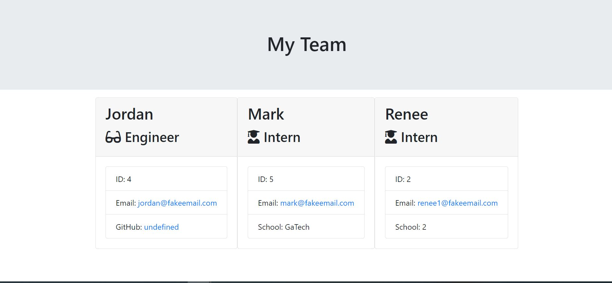

#Employee Generator

##Description
This project allows employers to create employee profiles based on their roles. There are three roles to choose from which are listed below:
        - Engineer
        - Intern
        - Manager

##Table of Contents

*Installation
*Usage
*Visual
*Contributing
*Tests
*Questions
*License

##Installation
This generator revolved around Node.js. Inquirer was also installed in order to create a series of questions to build the profiles.

##Usage
To efficiently create a profile for each employee.

##Visual

##Contributing
Acknowledgements goes to my tutor and bootcamp colleauges.

##Tests
To test this project, you would need to run node app.js, respond to the prompts, and open the html in the output directory to view your data.

##Questions
Questions can be sent to me via Github at:

https://github.com/hallkr86

##License

(https://opensource.org/licenses/MIT)